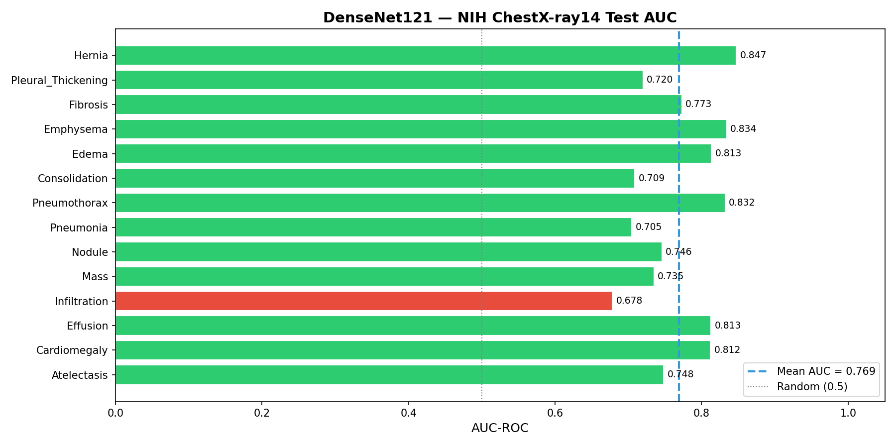
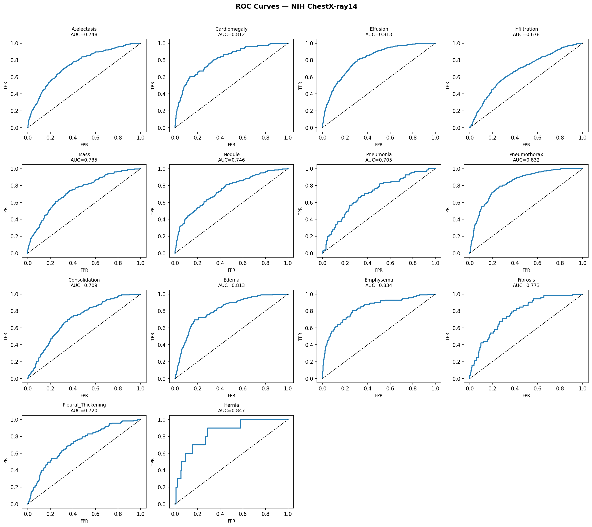
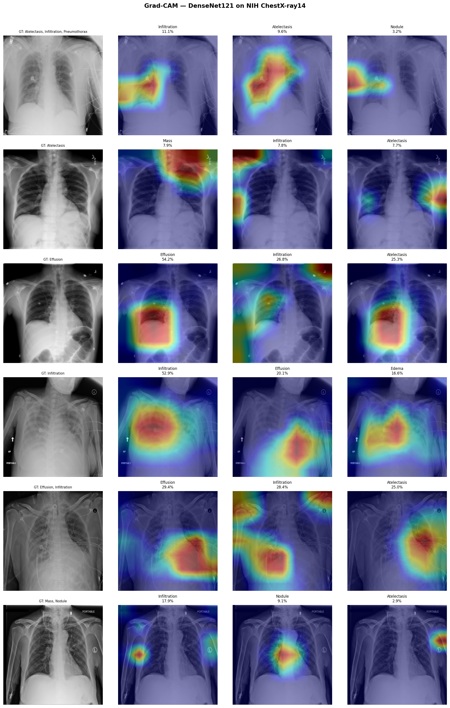

# ChestXplain: Explainable AI for Chest X-ray Disease Classification


## Abstract

Deep learning models for medical image classification achieve impressive accuracy, yet their black-box nature limits clinical adoption. This project implements an **Explainable AI (XAI) pipeline** for multi-label chest X-ray disease classification using **DenseNet121** with **Grad-CAM** (Gradient-weighted Class Activation Mapping) visual explanations.

The system classifies **14 thoracic pathologies** from the NIH ChestX-ray14 dataset and provides spatial heatmaps indicating which regions of the radiograph influence each prediction — enabling radiologists to verify whether the model attends to clinically meaningful features.

An interactive **Streamlit web application** allows users to upload X-rays, view disease predictions with confidence scores, and inspect Grad-CAM overlays in real time.

> **Trained on 20,000 real NIH images — Mean Test AUC: 0.769**  
> CheXNet benchmark (full 112K dataset): 0.841

---

## Results

### Per-Class AUC on NIH ChestX-ray14 Test Set

| Disease | AUC-ROC |
|---|---|
| Atelectasis | 0.748 |
| Cardiomegaly | 0.812 |
| Effusion | 0.813 |
| Infiltration | 0.678 |
| Mass | 0.735 |
| Nodule | 0.746 |
| Pneumonia | 0.705 |
| Pneumothorax | 0.832 |
| Consolidation | 0.709 |
| Edema | 0.813 |
| Emphysema | 0.834 |
| Fibrosis | 0.773 |
| Pleural_Thickening | 0.720 |
| Hernia | 0.847 |
| **Mean** | **0.769** |

> Trained on 20,000 images (subset), 10 epochs, GPU T4 on Kaggle. Early stopping triggered at epoch 6 (best val AUC 0.813).

### AUC Bar Chart


### ROC Curves


### Grad-CAM Explanations on Real X-rays


---

## Problem Formulation

Given a frontal chest radiograph **x** ∈ ℝ^(H×W×3), the task is multi-label classification over *C* = 14 disease categories:

**f(x; θ)** → **ŷ** ∈ [0, 1]^C

where each component ŷ_c represents the probability of the *c*-th pathology being present. The training objective minimises the binary cross-entropy loss:

$$\mathcal{L} = -\frac{1}{C} \sum_{c=1}^{C} \left[ y_c \log(\hat{y}_c) + (1 - y_c) \log(1 - \hat{y}_c) \right]$$

For explainability, Grad-CAM computes class-discriminative localisation maps **L_c** by leveraging gradients flowing into the final convolutional layer:

$$\alpha_k^c = \frac{1}{Z} \sum_i \sum_j \frac{\partial y^c}{\partial A_{ij}^k}$$

$$L^c = \text{ReLU}\left(\sum_k \alpha_k^c \cdot A^k\right)$$

where **A^k** denotes the *k*-th feature map and **α_k^c** captures the importance of feature map *k* for class *c*.

---

## Methods

### Architecture

- **Backbone**: DenseNet121 (Huang et al., 2017) pretrained on ImageNet
- **Classifier Head**: AdaptiveAvgPool → Dropout(0.3) → Linear(1024, 14)
- **Output Activation**: Sigmoid (independent per-class probabilities)

DenseNet's dense connectivity pattern — where each layer receives feature maps from all preceding layers — is well suited for medical imaging. Feature reuse helps preserve subtle low-level details (rib edges, pleural boundaries) critical for identifying pathologies like Pneumothorax or Pleural Thickening.

### Training Strategy

**Two-phase transfer learning:**

1. **Phase 1 — Warm-up (2 epochs):** Freeze the backbone, train only the classification head with LR = 1e-3. This prevents the randomly initialised head from corrupting pretrained ImageNet features.
2. **Phase 2 — Fine-tuning (8 epochs):** Unfreeze the entire network, train end-to-end with Adam (LR = 1e-4, weight decay = 1e-5). ReduceLROnPlateau scheduler with patience 2. Early stopping with patience 3.

### Explainability

**Grad-CAM** is applied to the output of the last dense block (`DenseBlock4`). For each predicted disease, the system generates a heatmap highlighting which spatial regions contributed most strongly to that prediction.

### Dataset

**NIH ChestX-ray14** (Wang et al., 2017): 112,120 frontal-view chest X-rays from 30,805 unique patients, annotated with 14 disease labels extracted via NLP from radiology reports.

Training used a **20,000-image subset** using the official train/test split files.

---

## Repository Structure

```
xai-medical-imaging/
├── src/
│   ├── config.py          # Hyperparameters, paths, disease labels
│   ├── dataset.py         # Data loading, transforms, train/val/test split
│   ├── model.py           # DenseNet121 architecture + freeze/unfreeze utilities
│   ├── train.py           # Two-phase training loop with checkpointing
│   ├── evaluate.py        # Test set evaluation, AUC computation, ROC curves
│   ├── gradcam.py         # Grad-CAM implementation + overlay generation
│   ├── visualize.py       # Sample Grad-CAM grid generation
│   └── __init__.py
├── outputs/
│   ├── auc_barplot.png    # Per-class AUC bar chart (real results)
│   ├── roc_curves.png     # ROC curves for all 14 diseases
│   ├── gradcam_samples.png # Grad-CAM on real NIH X-rays
│   └── test_results.json  # Full AUC numbers
├── app.py                 # Streamlit web application
├── run_all.py             # Master script (train → evaluate → visualise)
├── requirements.txt
├── packages.txt
├── .gitignore
└── README.md
```

---

## Setup & Usage

### Prerequisites

- Python 3.9 or newer
- 8 GB RAM minimum (16 GB recommended for full dataset)
- GPU optional but significantly speeds up training

### Step 1 — Clone the Repository

```bash
git clone https://github.com/ajinkya-awari/xai-medical-imaging.git
cd xai-medical-imaging
```

### Step 2 — Install PyTorch

Pick one based on your hardware:

```bash
# CPU only (slower but works everywhere):
pip install torch torchvision --index-url https://download.pytorch.org/whl/cpu

# CUDA 11.8 (if you have an NVIDIA GPU):
pip install torch torchvision --index-url https://download.pytorch.org/whl/cu118

# CUDA 12.1:
pip install torch torchvision --index-url https://download.pytorch.org/whl/cu121
```

### Step 3 — Install Remaining Dependencies

```bash
pip install -r requirements.txt
```

### Step 4 — Download the NIH Dataset

1. Go to the [NIH ChestX-ray14 dataset on Kaggle](https://www.kaggle.com/datasets/nih-chest-xrays/data)
2. Download and extract all files into the `data/` folder:

```
data/
├── Data_Entry_2017.csv
├── train_val_list.txt
├── test_list.txt
└── images/
    ├── 00000001_000.png
    ├── 00000001_001.png
    └── ... (112,120 images total)
```

3. Open `src/config.py` and set `DATA_DIR` to your data folder path:

```python
DATA_DIR = "data"   # or full path like "C:/datasets/nih-chestxray"
```

### Step 5 — Run the Full Pipeline

```bash
python run_all.py
```

This trains the model, evaluates on the test set, and generates Grad-CAM visualisations. On CPU this takes several hours. On a GPU it takes ~2–3 hours for the 20K-image subset.

### Step 6 — Launch the Web App

```bash
streamlit run app.py
```

Open `http://localhost:8501` in your browser, upload a chest X-ray, and explore the predictions and Grad-CAM heatmaps.

---

## Training on Kaggle (Recommended — Free GPU)

The model in this repository was trained on Kaggle with free T4 GPU. To reproduce:

1. Go to [kaggle.com](https://kaggle.com) → New Notebook
2. Add the NIH dataset: **+ Add Data** → search `NIH Chest X-rays` (by `nih-chest-xrays`) → Add
3. Set accelerator: **GPU T4 x2**
4. Use the Kaggle training notebook: `chestxplain_kaggle.ipynb` (included in this repo)
5. Run all cells — training completes in ~2.5 hours

---

## Streamlit Cloud Deployment (Free)

Deploy the web app publicly in 5 minutes:

1. **Fork or push** this repository to your GitHub account
2. Go to [share.streamlit.io](https://share.streamlit.io) → Sign in with GitHub
3. Click **New app**
4. Select your repository → Branch: `main` → Main file: `app.py`
5. Click **Deploy**

> **Note:** The deployed app needs the trained model file (`models/densenet121_chestxray.pth`). Upload it to the repo using Git LFS or host it separately and load via URL. Without the model it will run with random weights and show a warning.

---

## Technical Notes

- **Numerical stability**: The model outputs raw logits. `BCEWithLogitsLoss` applies sigmoid internally, which is more numerically stable than `Sigmoid + BCELoss`.
- **Reproducibility**: All random seeds fixed (NumPy, PyTorch, CUDA).
- **Grad-CAM hooks**: Forward and backward hooks are properly cleaned up after inference to prevent memory leaks during repeated predictions in the Streamlit app.
- **Multi-folder support**: The dataset loader automatically scans across all 12 NIH image subfolders (for Kaggle) or a single `images/` folder (for local use).

---

## References

1. Huang, G., Liu, Z., Van Der Maaten, L., & Weinberger, K. Q. (2017). Densely connected convolutional networks. *CVPR*.
2. Selvaraju, R. R., Cogswell, M., Das, A., Vedantam, R., Parikh, D., & Batra, D. (2017). Grad-CAM: Visual explanations from deep networks via gradient-based localization. *ICCV*.
3. Wang, X., Peng, Y., Lu, L., Lu, Z., Bagheri, M., & Summers, R. M. (2017). ChestX-ray8: Hospital-scale chest X-ray database and benchmarks. *CVPR*.
4. Rajpurkar, P., Irvin, J., Zhu, K., et al. (2017). CheXNet: Radiologist-level pneumonia detection on chest X-rays with deep learning. *arXiv:1711.05225*.
5. Awari, A. et al. (2023). Plant Disease Detection Using Machine Learning. *IJARSCT*, Volume 3, Issue 2. DOI: 10.48175/IJARSCT-9156

---

## Citation

```bibtex
@software{awari2025chestxplain,
  author    = {Awari, Ajinkya},
  title     = {ChestXplain: Explainable AI for Chest X-ray Disease Classification},
  year      = {2026},
  url       = {https://github.com/ajinkya-awari/xai-medical-imaging},
  license   = {MIT}
}
```

---

## Disclaimer

This system is a **research prototype** and is **not** intended for clinical diagnostic use. Predictions should not replace professional medical evaluation. Always consult a qualified radiologist for diagnosis.
